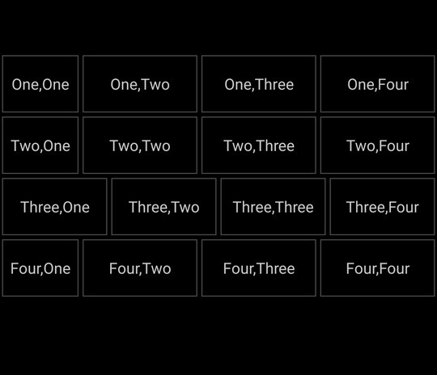
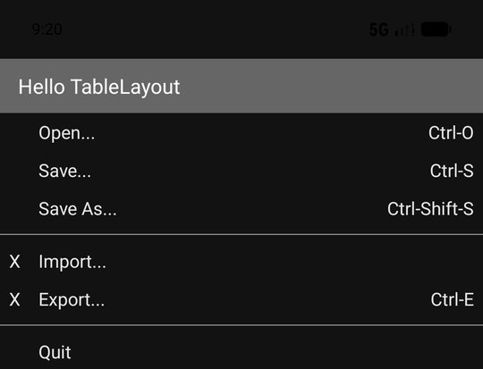
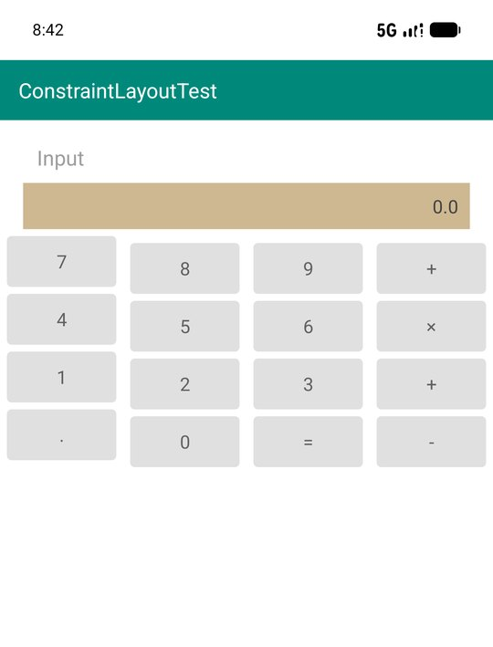
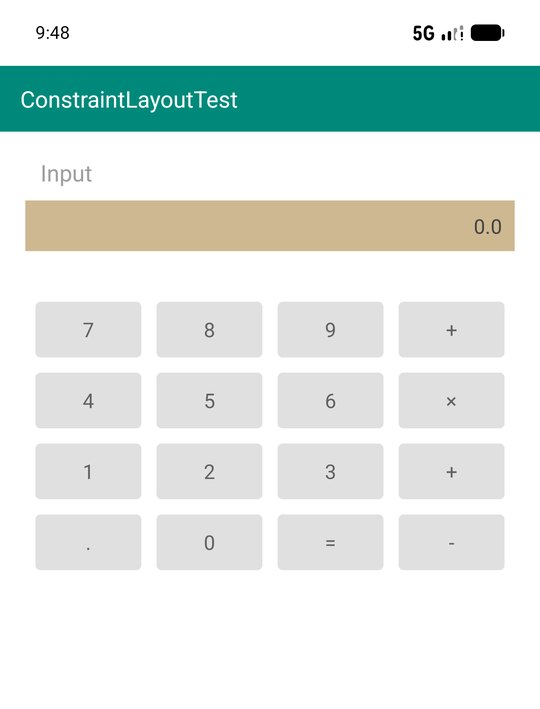
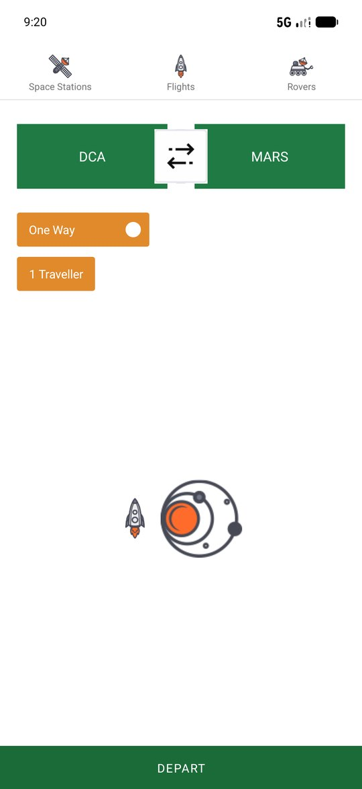
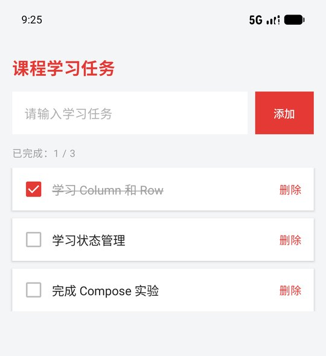
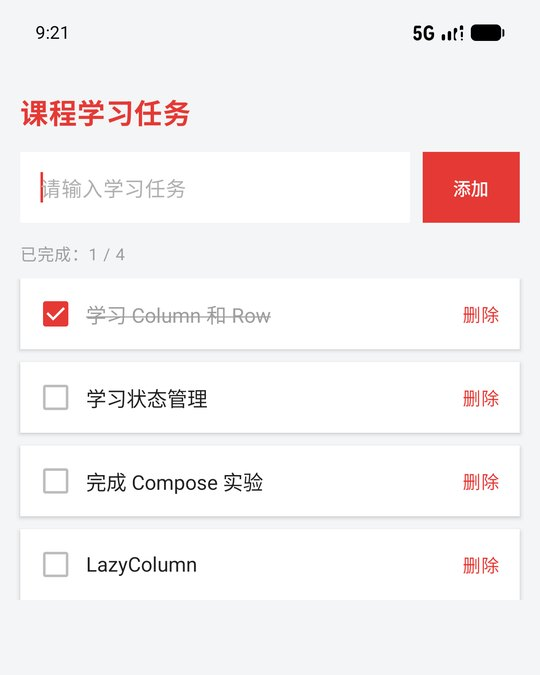
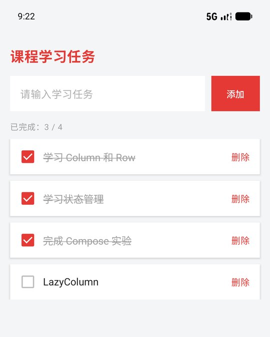

# 实验报告：Android 界面布局

## 1. 实验目的

1. 用线性布局实现四行格子
2. 用表格布局实现一个界面
3. 用约束布局实现计算器式按键界面
4. 用 Compose 的 `Column`、`Row`、`LazyColumn` 和状态管理，完成可以勾选、可添加、可删除的课程任务列表

## 2. 界面入口

五个实验各自是一个启动 Activity，安装后在桌面可以看到五个图标：线性布局、表格布局、约束布局1、约束布局2、Compose实验。点哪个图标就进入哪个界面。

运行的时候初出现问题，点击任何图标打开的都是同一个界面。原因是它们都带有 `MAIN` / `LAUNCHER`，却共用应用默认的 `taskAffinity`。桌面启动时会加上 `FLAG_ACTIVITY_NEW_TASK` 和 `FLAG_ACTIVITY_RESET_TASK_IF_NEEDED`，系统发现已有任务就把那个任务拉到前台，不会去启动图标对应的 Activity。给每个 Activity 设置了不同的 `android:taskAffinity`，并把 `launchMode` 设为 `singleTask` 之后，每个图标进入自己的实验界面。

在 Android Studio 中如果提示存在多个启动界面，可以打开 **Run → Edit Configurations…**，把 **Launch** 设为 **Specified Activity**，填入要运行的类名。

## 4. 线性布局

外层是纵向 `LinearLayout`，背景为黑色。每一行是一个横向 `LinearLayout`，格子是 `TextView`。横向宽度设为 `0dp`，再用 `layout_weight` 按比例分配。权重所在方向必须使用 `0dp`，否则权重不会按预期生效。

格子样式集中在 `LinearGridCell`：高度 56dp，灰字，黑色填充，带有边框。

```xml
<LinearLayout
    android:layout_width="match_parent"
    android:layout_height="match_parent"
    android:background="#FF000000"
    android:orientation="vertical">

    <LinearLayout
        android:layout_width="match_parent"
        android:layout_height="wrap_content"
        android:orientation="horizontal">

        <TextView
            style="@style/LinearGridCell"
            android:layout_weight="2"
            android:text="One,One" />
        <!-- 同一行其余格子权重为 3、3、3 -->
    </LinearLayout>
</LinearLayout>
```



## 5. 表格布局

界面采用深色背景。标题栏为 “Hello TableLayout”。`TableLayout` 设置 `android:stretchColumns="1"`，把第 1 列拉满剩余宽度。

Open、Save、Save As、Quit 通过 `android:layout_column="1"` 从第 1 列开始，快捷键放在右侧并右对齐。Import 和 Export 的第 0 列是 “X”。两组菜单之间用横跨整行的灰色 `View` 分隔。

```xml
<TableLayout
    android:layout_width="match_parent"
    android:layout_height="wrap_content"
    android:stretchColumns="1">

    <TableRow>
        <TextView
            style="@style/TableCell"
            android:layout_column="1"
            android:text="Open..." />
        <TextView
            style="@style/TableCell"
            android:gravity="end"
            android:text="Ctrl-O" />
    </TableRow>
</TableLayout>
```



## 6. 约束布局 1

根布局是 `ConstraintLayout`。青色标题栏、Input 标签和卡其色输入条都约束在父布局或上一个控件上。输入条右端显示 `0.0`。

按键是 4 行 4 列的 `TextView`。每一行用水平链连接，链样式为 `spread`，宽度为 `0dp`，从而均分屏幕宽度。

```xml
<TextView
    android:id="@+id/key7"
    style="@style/CalcKey"
    android:text="7"
    app:layout_constraintEnd_toStartOf="@id/key8"
    app:layout_constraintHorizontal_chainStyle="spread"
    app:layout_constraintStart_toStartOf="parent"
    app:layout_constraintTop_toBottomOf="@id/inputBar" />
```

##### 问题：左侧列按键对不齐

一开始左边一整列比右边三列高出一截，同一行的四个按键上下对不齐。

`CalcKey` 原来写的是 `android:layout_margin="6dp"`，上、下、左、右都有 6dp。每一行最左边的按键是这一行的基准，右边三个按键约束为顶部对齐这个基准。约束到另一个控件顶部时，自身的 `marginTop` 会再往下移 6dp，所以 8、9、+ 以及下面几行的右三列都比左边那个按键低 6dp。

进行了下面的修改：

1. 样式里只保留左右边距 `layout_marginStart` 和 `layout_marginEnd`，不再设置上下边距。行与行之间的空隙改由每行第一个按键的 `layout_marginTop` 控制
2. 同一行其余按键同时约束上沿和下沿到该行第一个按键，高度仍是 44dp，四个按键的顶边和底边因此重合

修改前，左边一列的顶边比右边三列高 6dp，四行都是这样：



修复后四行按键左右对齐，同一行高度一致：



## 7. 约束布局 2

顶部三个页签 Space Stations、Flights、Rovers 排成一条水平链，图标使用已有的图片。DCA 和 MARS 为绿色矩形，中间叠放双箭头 `double_arrows`。下方是橙色的 One Way（右侧有白色圆点）和 1 Traveller。底部是通栏绿色 DEPART。

火箭和行星放在 “1 Traveller” 与 DEPART 之间的空白区域。两个 `ImageView` 组成 `packed` 水平链，并同时约束上、下边界，因此这一组在水平方向和这段空白的垂直方向都居中。

```xml
<ImageView
    android:id="@+id/rocketDecor"
    android:src="@drawable/rocket_icon"
    app:layout_constraintBottom_toTopOf="@id/depart"
    app:layout_constraintEnd_toStartOf="@id/galaxy"
    app:layout_constraintHorizontal_chainStyle="packed"
    app:layout_constraintStart_toStartOf="parent"
    app:layout_constraintTop_toBottomOf="@id/traveller" />
```



## 8. Compose 实验

界面标题为 “课程学习任务”。初始有3个任务，可以添加、删除、完成任务。

状态放在 Compose 的 `remember` 中：

- 输入框文字使用 `mutableStateOf`
- 下一条任务编号使用 `mutableIntStateOf`
- 任务列表使用 `toMutableStateList()`，由 Compose 观察列表变化

勾选时用数据类的 `copy` 替换对应项，完成数和删除线会一起刷新。添加时把输入内容追加到列表末尾，空白内容会被忽略。删除时按任务 `id` 移除。列表使用 `LazyColumn`，每一项的 `key` 是任务编号。输入框、按钮和任务卡片使用直角，圆角半径为 0。

`ComposeTaskActivity.kt` 中的 `CourseTaskPreview` 带有 `@Preview`，可在 Android Studio 的 Split 或 Design 视图中预览初始界面。

```kotlin
val tasks = remember {
    listOf(
        StudyTask(1, "学习 Column 和 Row", true),
        StudyTask(2, "学习状态管理", false),
        StudyTask(3, "完成 Compose 实验", false),
    ).toMutableStateList()
}
val doneCount = tasks.count { it.done }
```

初始状态：



在输入框输入任务并点击 “添加” 后，计数分母增加。下面截图中新增的任务文字是 `LazyColumn`，计数变为 “已完成：1 / 4”。



再勾选另外两条原有任务后，这三条显示删除线，计数变为 “已完成：3 / 4”。



## 9. 问题

1. **AGP 9 与 Kotlin 插件。** 继续应用 `org.jetbrains.kotlin.android` 时，构建会直接失败，提示 AGP 9 起不再需要这个插件。去掉该插件、只保留 Compose 编译器插件后可以正常编译。
3. **火箭和行星位置。** 单独把行星偏向右侧时，图标组不在空白区域中央。改成 `packed` 链并约束到上下两个控件之后，图标组居中。
4. **Compose 预览为空。** 预览面板提示 “No preview found”。给界面函数增加 `@Preview` 后，Design 视图可以显示 “课程学习任务”。

## 10. 实验总结

`layout_weight` 适合做一行里按比例分宽的格子，但每一行的比例互相独立，因此各行竖线不会对齐。`TableLayout` 用列号和 `stretchColumns` 处理菜单这种 “左标题、右快捷键” 的对齐。`ConstraintLayout` 用约束和链把控件相对父布局或其他控件摆放，适合标题、按键网格，以及需要重叠、居中的旅行界面。

Compose 一侧把界面写成可组合函数，列表和完成数都从同一份状态推导。勾选、添加、删除只修改状态，界面随之重组，不需要手动调用 `notifyDataSetChanged`。
